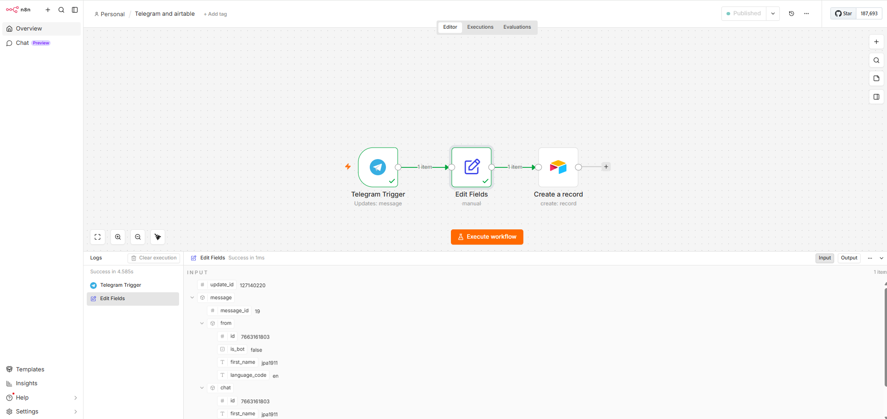
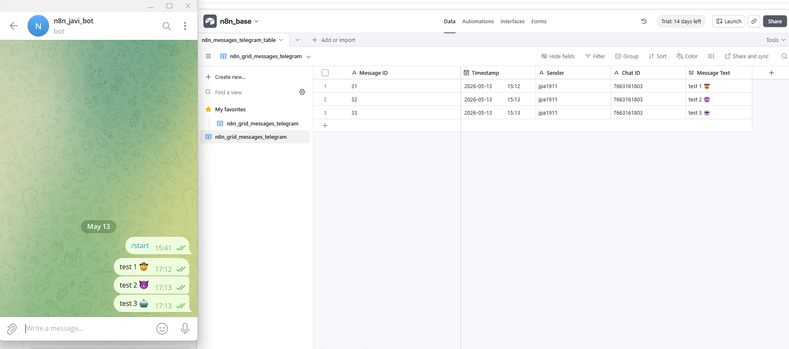

# Telegram to Airtable n8n Workflow

## Description

This repository contains a simple n8n multi-app integration workflow. The workflow receives Telegram bot messages, normalizes the message data with an Edit Fields / Set node, and creates structured records in Airtable.

## Screenshots
n8n screenshot showing n8n flow overview:


Airtable results storing telegram messages:



## Workflow

```text
Telegram Trigger → Edit Fields / Set → Airtable Create Record
